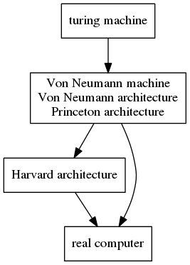

###Do you know these pieces of things

except foo, bar there are also other words somtimes used as nonsense identify such as foobar, fubar, baz, qux, and norf.

the earliest version of "hello world" could be tracked  was found at 1974 Bell Laboratories internal memorandum by Brian Kernighan, *Programming in C*: A tutorial and was being well-known by the book *The C Programming Language*.

the comment form /**/ comes from a programming language PL/I.

the Harvard architecture isn't same level with Von Neumann architecture in a relation tree, ENIAC isn't the first electric computer and isn't based on Von Neumann architecture, Von Neumann isn't the father of computer even electric computer, and there is a relation tree as follow.

